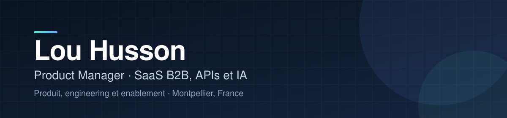

  

  

    
    
    
  

## À propos

Je pilote aujourd'hui des produits SaaS B2B et des APIs dans l'assurance chez [FASST](https://fasst.io),
à l'interface du produit, de l'engineering et de l'enablement.

Diplômé d'Epitech en 2015, j'ai cofondé dès la sortie d'école une plateforme de télé-échographie
pédiatrique, puis accompagné startups, éditeurs SaaS et grands comptes sur des produits complexes :
applications mobiles, plateformes, APIs, back-offices, de la discovery à l'adoption.

J'ai commencé par l'ingénierie : C et C++ bas niveau, avec des projets complets comme un Wolfenstein 3D et
un Bomberman. Le marketing, la data et le business sont venus ensuite. Je sais donc ce que coûte une
décision produit côté dev, et je continue à construire mes propres produits.

## Parcours

| Période | Rôle | Organisation | Ce que j'y ai fait |
| --- | --- | --- | --- |
| 2023 à aujourd'hui | Product Manager | [FASST](https://fasst.io) | Produits SaaS B2B et APIs dans l'assurance. Usage de l'IA pour prototyper et accélérer l'alignement, l'avant-vente et l'adoption. |
| 2020 à 2023 | Product Builder, indépendant | [Partner IT Group](https://hcinnovation.fr/) | Développement et gestion de projet pour Enedis, Carex et GoCLECD. |
| 2020 à 2021 | Product Manager | [Enedis](https://www.enedis.fr/) | Industrialisation de l'innovation produit par le Design Thinking. |
| 2020 | Product Builder | [map & match](https://mapandmatch.com/) | |
| 2019 à 2020 | Product Builder | [Netheos](https://www.namirial.com/fr/) | Solutions de KYC et de signature électronique. |
| 2017 à 2018 | Product Manager | You2You, devenu Yper | Partenariat avec DHL Express et offre last mile à 97 % de livraisons réussies. |
| 2013 à 2017 | Fondateur | [Bress Healthcare](https://www.maddyness.com/2016/03/15/bress-healthcare-e-sante/) | Plateforme de télé-échographie pédiatrique Echoes avec La Chaîne de l'Espoir : 6 pays, plus de 450 téléconsultations la première année. |
| 2014 à 2017 | Europe Manager | [while42](https://www.comite-officiel.org/while42.html) | Réseau français d'ingénieurs, French Tech Engineers Network. |
| 2014 à 2015 | Rédacteur technique | [React](https://fr.react.dev/) | Rédaction de quatre « Community Round-up » du [blog officiel de React](#contributions-open-source) avec Christopher Chedeau. |

Formation : [Epitech](https://www.epitech.eu/), European Institute of Technology, promotion 2015.

## Produits que je construis

Depuis un an, je pratique le vibe coding pour passer vite de l'idée à un produit en ligne. J'ai aussi
créé en interne une trentaine d'applications et de démonstrateurs (maquettes, POC, réservation de salles,
catalogues produit, roadmaps, plateformes de démo).

| Produit | Ce que c'est | Public |
| --- | --- | --- |
| [Héros de la classe](https://herosdelaclasse.com/) | Histoires interactives dont l'enfant est le héros, pour apprendre le programme du CP au CM2. Profils, progression sauvegardée, cartes à collectionner. | Enfants de 6 à 11 ans |
| [Okodukai](https://okodukai.fr/) | Portefeuille éducatif familial piloté par les parents : gagner, choisir, dépenser, économiser, attendre, comprendre l'investissement. Pas une banque, aucun paiement réel. | Enfants de 8 à 12 ans |
| [Politiquizz](https://comprendrelapolitique.vercel.app) | Quiz et analyses thématiques qui comparent ses opinions aux votes de l'Assemblée nationale et aux programmes. Données publiques et traçables. | Citoyens |
| [MindOdyssey](https://github.com/loukan42/MindOdyssey-public) | Aventure et construction de village sur 10 époques et 60 missions sourcées. Ni compte enfant, ni classement, ni traceur. | Enfants de 7 à 12 ans |
| [Not My Fault](https://not-my-fault.vercel.app) | Jeu coopératif de crise dans le navigateur : rôles privés, 15 minutes, aucun compte. Serveur autoritaire et moteur déterministe testé. | Groupes de 2 à 5 joueurs |

## Ce que mes produits ont en commun

Pour Okodukai, j'ai écrit ce que le produit ne fera jamais avant de coder : pas de classement entre
enfants, pas de streak punitive, pas de monnaie réelle. MindOdyssey n'a ni compte enfant ni traceur. Dans
Not My Fault, le serveur décide de tout ce qui compte et chaque navigateur ne reçoit que la vue de son
joueur.

## Compétences

- Produit : discovery, vision et roadmap, spécifications, priorisation, delivery, adoption, Design Thinking.
- Domaines : assurance, SaaS B2B, APIs, KYC et signature électronique, e-santé, logistique du dernier kilomètre.
- Technique : C, C++, TypeScript, React, Next.js, Zod, Playwright, Vercel.
- IA : prototypage avec Claude Code et Lovable, cas d'usage de l'IA dans l'assurance santé et prévoyance.

## Contributions open source

En 2014, j'ai rédigé quatre numéros des « Community Round-up » du blog officiel de [React](https://react.dev),
avec Christopher Chedeau. Chaque numéro rassemble les projets, les retours d'expérience et les adoptions de
React dans la communauté.

| Numéro | Date | Sujets |
| --- | --- | --- |
| [Community Round-up #20](https://legacy.reactjs.org/blog/2014/07/28/community-roundup-20.html) | 28 juillet 2014 | Atom passe à React, performance, rechargement à chaud, internationalisation |
| [Community Round-up #21](https://legacy.reactjs.org/blog/2014/08/03/community-roundup-21.html) | 3 août 2014 | React Router, performance, nouvelles bibliothèques |
| [Community Round-up #22](https://legacy.reactjs.org/blog/2014/09/12/community-round-up-22.html) | 12 septembre 2014 | Adoption chez Yahoo, Mozilla, Airbnb et Reddit, architecture, performance |
| [Community Round-up #23](https://legacy.reactjs.org/blog/2014/10/17/community-roundup-23.html) | 17 octobre 2014 | Implémentations de Flux, adoption chez Yahoo et Adobe |

## Écrits

Deux [articles sur LinkedIn](https://www.linkedin.com/in/louhusson/recent-activity/articles/) : les cas
d'usage de l'IA dans l'assurance santé et prévoyance (juillet 2025), et une chronologie de l'emballement
autour d'OpenClaw, Moltbook et ClawHub.

## In English

Product Manager at [FASST](https://fasst.io), working on B2B SaaS products and APIs in insurance, between
product, engineering and enablement. Epitech graduate (2015). I co-founded Bress Healthcare right after
school: Echoes, a pediatric tele-ultrasound platform with the NGO La Chaîne de l'Espoir, deployed in six
countries with more than 450 teleconsultations in its first year.

Since 2017 I have worked on complex products for startups, SaaS vendors and large accounts: Yper (DHL Express
partnership, 97% successful last-mile deliveries), Netheos (KYC and e-signature), Enedis (Design Thinking
for product innovation). I also build my own products, such as a school-programme storybook for children
(Héros de la classe), a family finance-education wallet (Okodukai) and a civic-tech quiz on parliamentary
open data (Politiquizz).

In 2014 I also wrote four issues of the official React blog's Community Round-up (#20 to #23), alongside
Christopher Chedeau.

Find me on [LinkedIn](https://www.linkedin.com/in/louhusson/).
